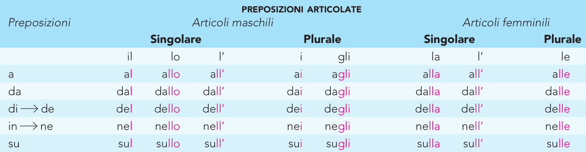

# **Adjectives**

# Irregular Adjectives 

# Possessive Adjectives

# Comparatives and Superlatives 

# Comparisons 

## Majority and minority comparatives – Comparativi di maggioranza e minoranza

In order **to compare two or more elements**, we normally use *più di*
(more than +) for the comparisons of majority and *meno di* (less than
-) for the comparisons of minority:

**“più/meno** + adjective + **di** + nouns / personal pronouns”

# MAJORITY

\+ Martina è **più** simpatica **di** Luisa

\+ Luca è **più** alto **di** me

\+ Il cane è **più** fedele **del** gatto

\+ Il computer è **più** moderno **della** macchina da scrivere

# MINORITY

– Luisa è meno simpatica di Martina

– Io sono meno alto di Luca

– Il gatto è meno fedele del cane

– La macchina da scrivere è meno moderna del computer

We normally use *più che* (more than) or *meno che* (less than) to
compare two or more elements belonging to all the other cases:

**“più/meno** + adjective + **che** + adjectives, verbs, adverbs,
prepositions” no

-   Luca è **più/meno** alto **che** bello

-   Il computer è **più/meno** utile **che** difficile da usare

-   Mi piace **più/meno** cucinare **che** mangiare

-   Giocare a tennis è **più/meno** divertente **che** studiare

-   Il clima in Sicilia è **più/meno** mite **che** in Lombardia

-   Anna è **più/meno** gentile con Tatiana **che** con me

-   Mio fratello è **più/meno** affezionato a mio padre **che** a mia madre

# Comparative of Quantity – Comparativo di quantità

We express **comparative of quantity** with the construction:

**“Più … che”**

-   Leggo **più** giornali **che** libri

-   In quel paese ci sono **più** poveri **che** ricchi

-   Bevo **più** tè **che** caffè

-   Lucia ha **più** vestiti **che** scarpe

## Comparative of equality – Comparativo di uguaglianza

When we want to **express the same quantity**, we use the construction:

**“Tanto … quanto” / “Così … come”**

-   Quel cane è fedele **quanto** un gatto

-   Luca e Mattia sono studiosi **quanto** noi

-   Pietro è alto **come** Leo

-   Lucia è magra **come** me

Sometimes adjectives can be forerun by *tanto,* if with the second
element of comparison we use *quanto:*

-   Leonardo è (**tanto**) grasso **quanto** basso

-   Il computer è (**tanto**) utile **quanto** costoso

-   Marta è (**tanto**) timida **quanto** Lisa

Otherwise, adjectives can be forerun by *così,* if with the second
element of comparison we use *come*:

-   Marta è (**così**) timida **come** Lisa

-   Voi siete (**così**) giovani **come** noi

-   Gli studenti della tua classe sono (**così**) diligenti **come** noi

## The relative superlative – Il superlativo relativo

The relative superlative **indicates a person or thing’s quality
expressed to the maximum or the minimum level**, **in relation to a
group**.

The **relative superlative of majority** is expressed by *il più di,*
meanwhile the **relative superlative of minority** is expressed by *il
meno di*.

“(**Article**) + noun + **più /meno** + adjective + (**di/fra-tra**)”

-   Questo è **il** ragazzo **più** bravo **di** tutti.

-   Giorgio è **il più** alto **tra** i ragazzi della mia classe

-   Roma è **la più** grande **fra** le città d’Italia

-   Giove è **il più** grande pianeta **del** sistema solare.

-   Mattia è **il meno** alto **del** gruppo

-   Siena è **la** città **meno** sporca **d’**italia

-   Questo ragazzo è **il meno** bravo **tra** quelli della sua classe

-   Laura è **la** studentessa **meno** diligente **della** classe

**Pay attention**: **the relative superlative** expresses an opinion
that **takes the subjunctive!**

-   Questo è **il più** bel libro **che** *abbia* mai letto

-   Luca è **il** ragazzo **più** simpatico **che** *conosca*

-   La torta della nonna è **la più** buona **che** *abbia* mai mangiato

## The absolute superlative – Il superlativo assoluto

The absolute superlative **indicates the quality expressed to the
maximum and absolute grade, independent to any comparison**:

**“Adjectives** – **the last vowel** + **issimo/issima/issimi/issime”**

-   Giove è un pianeta grand**issimo** = molto grand(e)

-   Questo caffè è amar**issimo** = molto amar(o)

-   Siena è bell**issima** = molto bell(a)

-   La grammatica italiana è difficil**issima** = molto difficil(e)

-   Marta e Luisa sono alt**issime** = molto alt(e)

-   Laura e Silvia sono elegant**issime** = molto elegant(i)

-   Questi ragazzi sono brav**issimi** = molto brav(i)

-   Questi libri sono interessant**issimi** = molto interessant(i)

Orally, we can also express it **joining the adjective with another
one**, which will strengthen it:

-   Oggi ho lavorato tutto il giorno senza pausa: sono **stanca morta**! = stanchissima/molto stanca

-   Matteo è **innamorato cotto** di Giulia = innamoratissimo/molto innamorato

-   Stamattina è iniziato a piovere e non avevo l’ombrello, sono arrivata al lavoro **bagnata fradicia** = bagnatissima/molto bagnata

-   Brad Pitt è **bello da morire**! = è bellissimo/è molto bello

-   Il proprietario di quella villa con piscina ha anche una barca a vela e altre due case alle Maldive, è **ricco sfondato**! = ricchissimo/molto ricco

Or **adding prefixes** like: ***arci- /*** ***stra-***

-   Il proprietario di quella villa con piscina ha anche una barca a vela e altre due case alle Maldive, è **straricco**! = ricchissimo/molto ricco

-   Matteo è **strainnamorato** di Giulia = innamoratissimo/molto innamorato

-   Brad Pitt è **arcifamoso** = famossissimo/molto famoso

# Demonstratives 

