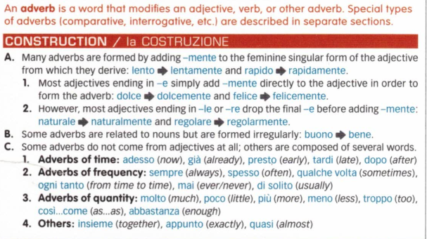
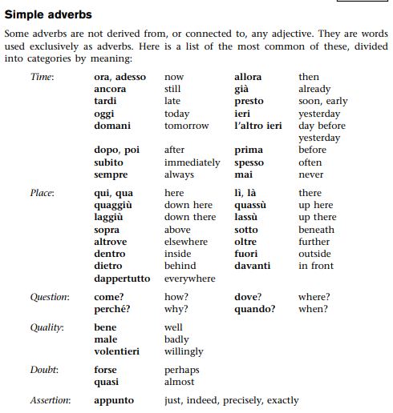

# Adverbs

You already know that adjectives modify nouns, and that they agree in
gender and number with the noun they modify. Adverbs, in contrast, are
invariable (their endings don’t change), and they can modify verbs,
adjectives, or other adverbs. **Adverbs indicate <u>how</u> an action is
performed**. Some common adverbs that you already know are bene, male,
and molto.

