# Nouns and Articles -- Noun Groups are Key!

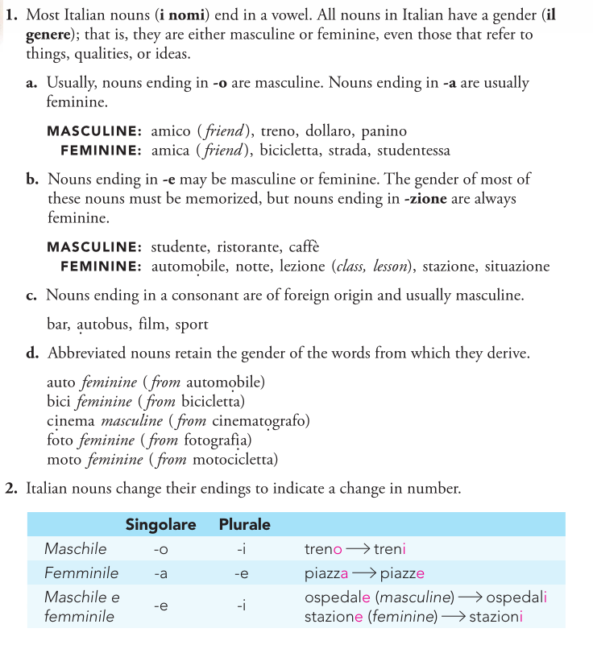

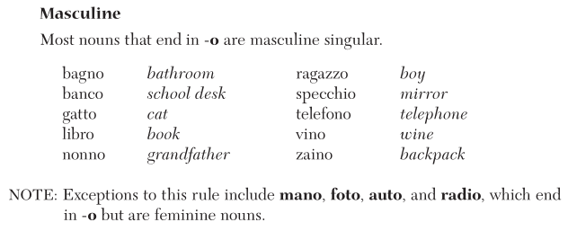

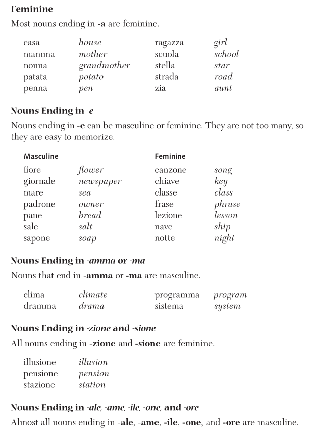

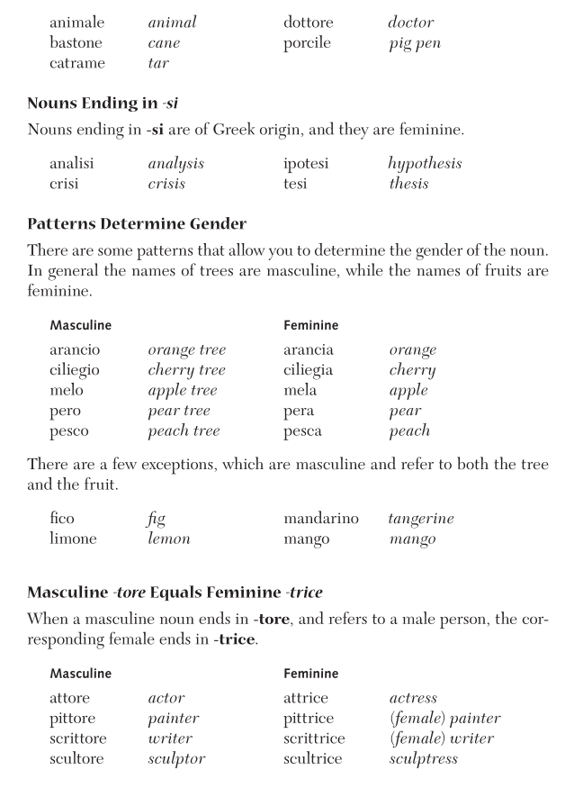

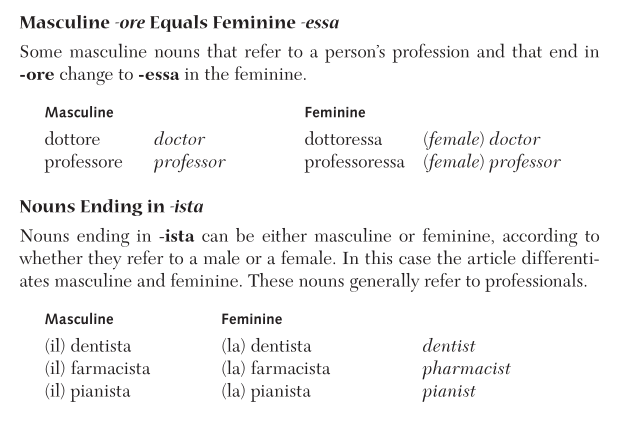

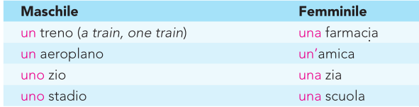

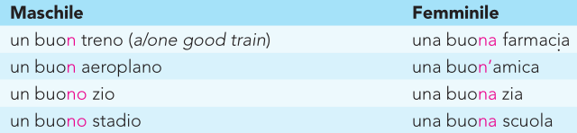

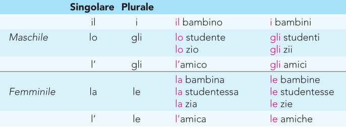

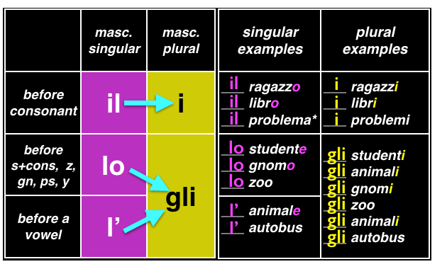

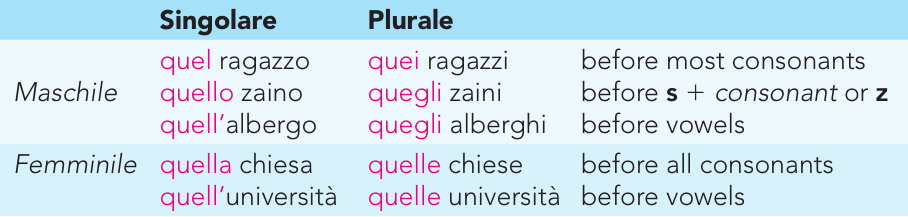

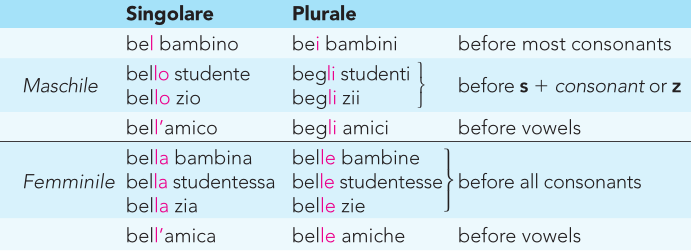

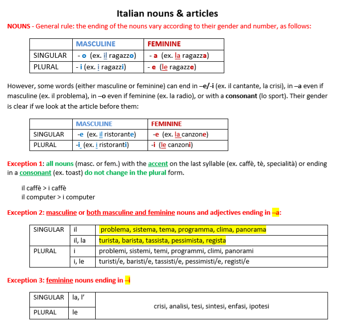

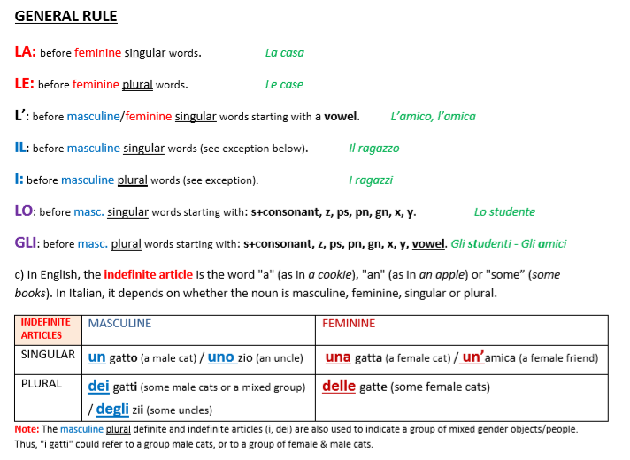

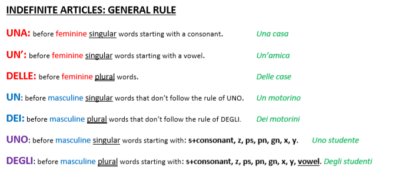

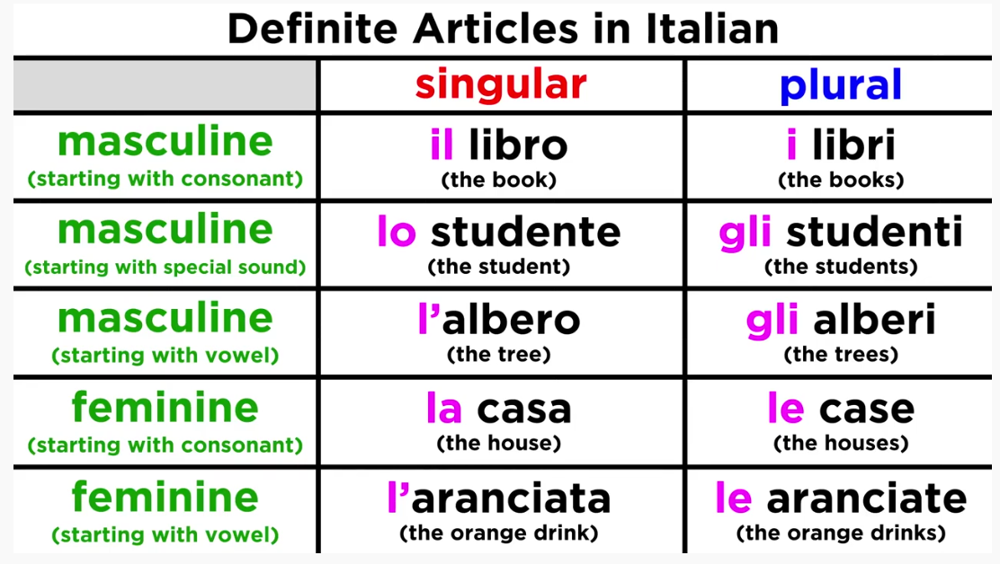

# 

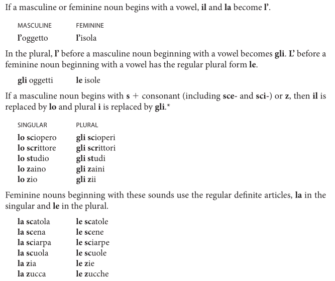

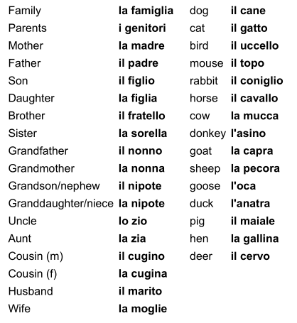

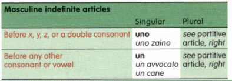

# Cognates

# Contractions 

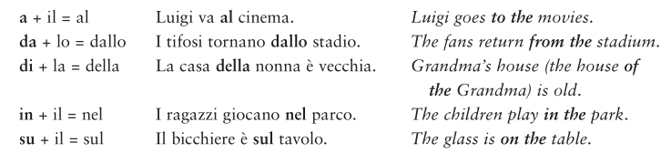

- When using the definite article (il, lo, la, I’, i, gli, le) with the
prepositions a,da, di, in and su (to, from, of, in and on) the
preposition and the article can combine to make a new form:

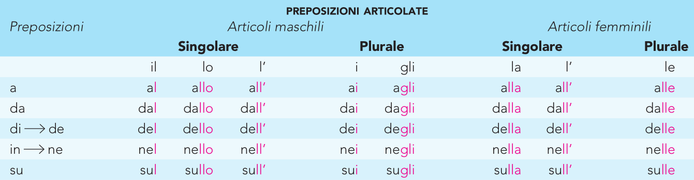