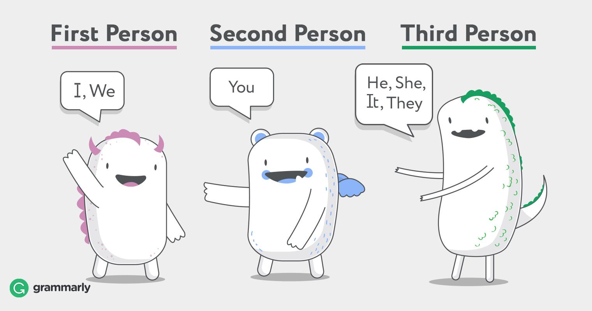
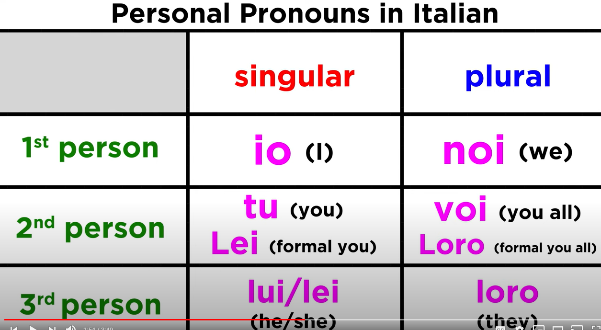
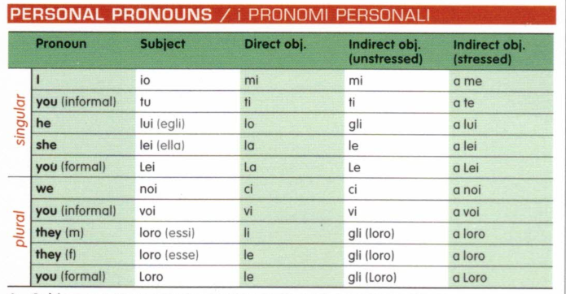
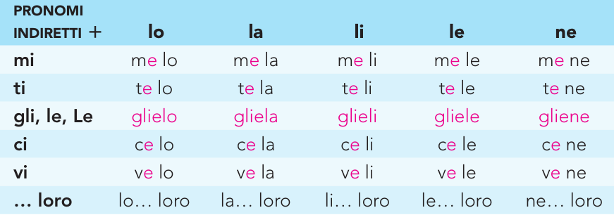
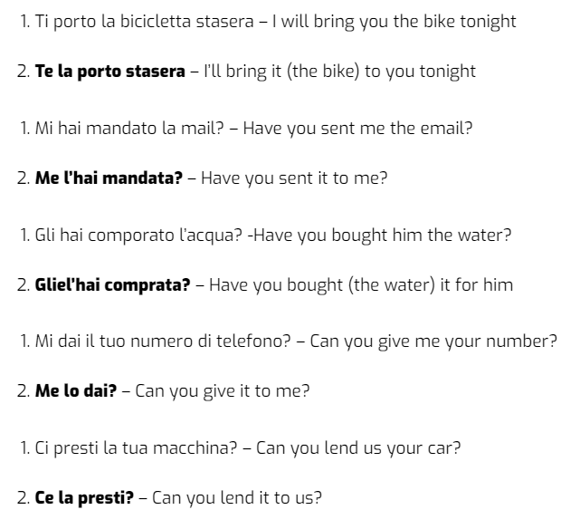
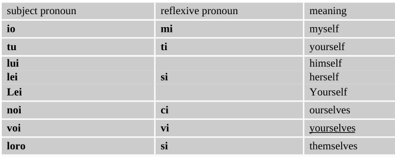

# **Object Pronouns**

# Key Patterns

-   **mi, ti, ci** and **v**i are both direct and indirect pronouns.

-   **lo, la, li,** and **le** are only direct pronouns!

-   The equivalent <u>indirect</u> forms are

    -   **gli** to him/for him

    -   **le** to her/for her

    -   **gli** to them/for them.

-   Lei (formal) = La direct , Le for indirect Loro (you formal) le, gli

-   First comes the <u>indirect pronoun</u>, then the direct pronoun.

-   The vowel i of the indirect pronoun (mi, ti, ci, vi, si) changes to e (me, te, ce, ve, se).

-   gli and lo fuse to glielo.

# Subject Pronouns 

# Direct Objects 

In the Direct example, we answered the question "**<u>WHO is it that you
know</u>**?"

-   **mi, ti, ci and vi are both direct and indirect pronouns.**

-   lo, la, li, and le are only direct pronouns!

-   The equivalent indirect forms are gli to him/for him, le to her/for her, and gli to them/for them.

    -   **mi**  =  me

    -   **ti**    =  you

    -   <u>**lo**   =  him/it</u>

    -   <u>**la**   =  her/it</u>

    -   **ci **  =  us

    -   **vi**   =  you guys/all

    -   <u>**li**    =  them (masc.)</u>

    -   <u>**le **  =  them (fem.)</u>

## Examples

-   Mi ha chiamato Maria. **Maria called me.**

-   Ho preso il giornale. Lo vuoi leggere? **I’ve bought the paper. Do You want to read it?**

-   Chiamami domani. **Call me tomorrow.**

-   Conosci Tom? (Do you know Tom?) Sì, LO conosco **Yes, IT IS HIM that I know**

-   Sì, ti vedo Yes, I see you.

-   Conosci Matteo? **Do you know Matthew?** No, non lo conosco **No, I don't know him**

-   Ci vedono **They see us**

-   Vi vedono **They see you guys**

-   aiutate le ragazze? - sì, le aiutiamoj

-   hai mangiato la mela? - sì, l'ho mangiata

-   Lui mi ha colpito. **He hit me**.

-   Io ti amo. **I love you**

-   Tu lo troverai nel cassetto. **You will find it in the drawer**

-   Io la porterò al negozio. **I will take her to the store**.

-   Loro ci visitano. **They are visiting us.**

-   Io vi saluto. **I greet you all**.

-   Luigi li finisce. **Luigi is finishing them**.

-   Mi dai questo. **You give this to me (literally: to me, you give this**

-   Mi compri questo. Y**ou buy this for me (literally: for me, you buy this)**

-   Io t’amo. **I love you.**

-   Cerco il libro, ma non lo trovo. **I’m looking for the book, but I can’t find it.**

-   Ieri mi hanno chiamato. **They called me yesterday.**

-   Non so perché non ci hanno invitato. **I don’t know why they didn’t invite us.**

-   Giovanni abita lontano. Non lo vedo mai. Giovanni lives far away. **I never see him.**

-   Anna parla male il francese. Nessuno la capisce. **Anna speaks French badly. No one understands her.**

-   I problemi sono difficili. Non li ho risolti. **The problems are difficult. I haven’t solved them.**

-   Dove sono le chiavi? Non le trovo. **Where are the keys? I can’t find them.**

## Passato Prossimo with Direct Objects 

-   Hai comprato i fiori? Sì, li ho comprati. **Did you buy flowers? Yes, I bought them.**

-   Ho invitato Anna due volte al mio compleanno ma non è mai venuta, quindi non l‘ho più invitata.

    -   **I invited Anna twice to my birthday party but she never came, so I haven’t invited her again.**

-   Le scarpe di tua sorella sono bellissime, dove le ha comprate?

    -   **Your sister’s shoes are beautiful, where did she buy them?**

-   Tu l’hai trovato nel cassetto. **You found it in the drawer.**

-   Io l’ho portata al negozio. **I took her to the store**

-   Chi te l’ha detto? Me l’ha detto lui. **Who told you that? He told me.**

-   Lui m’ha colpito. **He hit me.**

-   Ho comprato il biglietto**. (I bought the ticket.) →** L’ho
    > comprato. **(I bought it.)**

-   Ho comprato la pizza. **(I bought the pizza.) →** L’ho comprata**. (I bought it.)**

-   Ha comprato i pomodori. **(He bought the tomatoes.) →** Li ha comprati. **(He bought them.)**

-   Hanno comprato le sedie**. (They bought the chairs.) →** Le hanno comprate. **(They bought them.)**

-   Hai comprato le mele? **(Did you buy apples?)** Sì, le ho comprate! **(Yes, I bought them!)**

-   Hai preparato gli spaghetti? Sì, li ho preparati.

-   Chi ha fatto la torta? Marianna l’ ha fatta.

## Easier Methods – Modal Verbs! 

-   Whenever you've got 2 verbs in a sentence you can add the Direct Object Pronoun onto the end of the second verb that's in its infinitive form (ends in -are, -ere, or -ire).

    -   We'll call this an exception to the rule - because usually the Direct Object Pronoun always goes before the verb.

-   Sì, voglio leggerli. **Yes, I want to read them.**

-   Sì, voglio vederle. **= Yes, I want to see them.**

-   Voglio telefonarLE domani. **– I want to call her tomorrow.**

# Indirect Objects

In the Indirect example, we answered the question "**<u>TO WHOM will you
write something</u>**?"

## 

## Common Verbs

Indirect object pronouns are usually paired with Italian verbs that have
to do with **<u>giving</u>.**

-   Dare (to give)

-   Offrire (to offer)

-   Consegnare (to deliver)

-   Regalare (to give as a gift)

-   Restituire (to give back)

-   Prestare (to lend)

-   Mandare (to send)

-   Portare (to bring)

Indirect object pronouns are also paired with verbs that have to do with
**<u>communicating</u>.**

-   Parlare (to talk, to speak)

-   Dire (to say, to tell)

-   Domandare (to demand,ask)

-   Spiegare (to explain)

-   Chiedere (to ask)

-   Rispondere (to answer)

-   Scrivere (to write)

-   Insegnare (to teach)

-   Consigliare (to suggest)

-   Telefonare (to call)

Others

-   to read to leggere

-   to write to scrivere

-   to bring portare

-   to prepare preparare

-   to lend prestare

-   to return, give back restituire

-   to bring back riportare

-   to show mostrare

## 

## TO or FOR

1.  Mi puoi portare qualcosa da bere? **Can you bring me something to drink?**

2.  Sì, ti porto qualcosa subito! **Yes, I'll bring you something right away!**

    -   This answers the question, TO WHOM will you bring something? TO YOU.

3.  Ci dai più tempo, per favore? **Can you give us more time, please?**

    -   This answers the question, TO WHOM can you give more time? TO US.

4.  Vi chiediamo scusa. **We ask for your forgiveness**

    -   This answers the question, TO WHOM are you asking forgiveness? TO YOU GUYS.

5.  Lui vuole parlare con mia mamma? **He wants to talk to my mom?**

6.  No, non le vuole parlare **No, he doesn't want to talk to her**

    -   This answers the question, WHO IS IT that he wants to talk to? TO HER

7.  Mi dai questo. **You give this to me (literally: to me, you give this)**

8.  Mi compri questo. Y**ou buy this for me (literally: for me, you buy this)**

9.  Ti do questo **I give this to you (literally: to you, I give this)**

10. Ti compro questo **I buy this for you (literally: for you, I buy this)**

11. Vi do questo **I give this to you – plural (literally: to you, I give this)**

12. Vi compro questo **I buy this for you – plural (literally: for you, I buy this)**

13. Gli do questo **I give this to him/them (literally: to him/them, I give this)**

14. Gli compro questo **I buy this for him/them (literally: for him/them, I buy this)**

15. Le do questo **I give this to her (literally: to her, I give this)**

16. Le compro questo **I buy this for her (literally: for her, I buy this)**

17. Ci dai questo **You give this to us (literally: to us, you give this)i**

18. Ci compri questo **You buy this for us (literally: for us, you buy this)**

## Examples 

-   Non GLI parlo. – **I am not talking to him.**

-   LE ho offerto un caffé. – **I offered her a cup of coffee. (Think: I offered a cup of coffee TO her.)**

-   Cos’hai detto quando GLI hai scrito lo to? – **What did you say when you wrote to him?**

-   Le abbiamo dato un libro ieri. – **We gave a book to her yesterday.**

-   A loro piace mangiare qui. – **They like to eat here.**

-   Sì, gli scrivo qualcosa **Yes, TO HIM I'll write something**

-   Mi puoi portare qualcosa da bere? **To me, can you bring something to drink?**

-   Sì, ti porto qualcosa subito! **Yes, I'll bring you something right away!**

-   Ci dai più tempo, per favore? **To US, can you give more time, please?**

-   Vi chiediamo scusa. **We ask for your forgiveness**

-   Qulacuno mi ha mandato una cartolina dalla Spagna. **Someone (has) sent me a postcard from Spain.**

-   Il professore le ha spiegato il problema  **The teacher to her (has) explained the problem**

-   Gli hai detto di comprare un regalo per sua madre? **Did you tell him/them to buy a present for (his/their) mother.**

-   Il signor Brambilla ci ha insegnato l'italiano **Mr Brambilla taught us Italian.**

-   Cosa gli dici? **What are you saying to him/to them?**

-   Lucia,tuo padre vuole parlarti! I **Lucia, your father wants to speak to you!**

-   Non gli ho mai chiesto di aiutarmi  **I (have) never asked him to help me.**

-   Non oserei consigliarti  **I would not dare to advise you**

-   Le ho regalato un paio di orecchini  **I gave her a present of a pair of earrings.**

-   Le ho dato tre ricette. **- I gave her three recipes.**

-   Ci offrono un caffè. **- They offer us a cup of coffee.**

-   Me l’ha dato Francesca. **Francesca gave it to me.**

-   Gli ho dato la cartina. **I gave him the map.**

-   Ho chiesto loro di restare**. I’ve asked them to stay.**

-   Il professore mi dà i compiti. **(The teacher gives me homework.)**

-   Io ti scrivo ogni settimana. **(I write to you each week.)**

-   Il cameriere gli dice che non ha il vino bianco. **(The waiter tells him that he doesn’t have white wine.)**

-   Sua madre le ha telefonato. **(Her mother called her.)**

-   Non ci hanno mandato un messaggio. **(They didn’t send us a message.)**

-   Lei vi ha letto il libro. **(She read the book to you all.)**

-   Lo studente gli ha insegnato una nuova parola. **(The student taught them a new word.)**

-   Ho detto a Luisa di comprare il pane – **I said to Luisa to buy some bread**

-   Le ho detto di comprare il pane – **I said to her to buy some bread**

-   Ho prestato la bicicletta a te la settimana scorso – **I lend the bike to you last week**

-   Ti ho prestato la bici la settimana scorso – **I lend you the bike last week**

-   Ho telefonato a Lucia e Michele – **I phoned (to) Lucia e Michele**

-   Gli ho telefonato – **I phoned them**

-   Scrivi sempre a Marco? – **Do you write often to Marco?**

-   Gli scrivi sempre? – **Do you write to him often?**

## Using with Prepositions

## Easier Method -- Modal Verb

-   Puoi spiegargli la grammatica? – **Can you explain the grammar to him?**

-   Voglio telefonargli **I want to phone him.**

# Indirect + Direct Combination

**In everyday Italian, however, loro is replaced by gli and is written
as one word with a following direct object pronoun.**

## Example 

-   **Glielo do.** I give it to him:

-   **Glieli diamo.** (To her, them) .. we give

-   **Glieli abbiamo dati.** We gave them to her

-   **Te le ho portata.** I brought them to you.

-   **Mi dai il pane?** - Can you give me the bread?

-   **Me lo dai?** - Can you give it to me?

-   **Ti voglio offrire una birra -** I want to offer you a beer

-   **Te la voglio offrire -** I want to offer it to you

-   **Puoi spiegare la regola a Maria? -** Can you explain the rule to Maria?

-   **Certo, gliela spiego subito -** Sure, I'll explain it to her right away

-   **Puoi dire le regole a loro, per favore? -** Can you tell them the rules, please?

-   **Ok, gliele dico adesso** Okay, I'll tell them now

-   **Chi ci porterà i biscotti? -** Who will bring us the cookies/biscotti?

-   **Giovanna ce li porterà -** Giovanna will bring them to us

-   **Ci prometti che verrai alla festa? -** Promise us you'll come to the party?

-   **Ve lo prometto -** I promise (it to you guys)

-   **Chi te l'ha detto?-** Who told you (that)?

-   **<u>Glieli</u> ho dati già -** I already gave them to him/her

-   **I revisori vogliono vedere il bilancio.** The auditors want to see the balance sheet.

    -   **<u>Glielo</u> mandiamo subito.** We’re sending it off to them right away.

-   **Ho lasciato la mia borsa a casa tua, me la porti per favore?**I left my bag at your place, can you bring it back to me please?

-   **Non sa quando Anna andrà in vacanza, glielo chiederà domani.** He doesn’t know when Anna is going on holiday, he will ask her tomorrow.

-   **Ho dimenticato di darti le chiavi, te le do stasera.**I forgot to give you the keys, I will give them to you tonight.

-   **Hai detto a Maria che sua madre la cercava con urgenza?** \[Did you tell Maria that her mother was looking for her urgently?\]

-   **No, glielo dico subito!** \[No, I’ll tell her right away!\]

-   **Qualcuno ha mandato un mazzo di fiori a Federica.** \[Someone sent Federica a bunch of flowers.\]

-   **Glielo hanno portato stamattina?** \[Did they bring (her) them/it this morning?\]

-   **Diego, mi puoi prestare la tua bicicletta per un paio d’ore?** \[Diego, can you lend me your bike for a few hours?\]

-   **Sì, te la presto, ma fai attenzione a non rovinarla.** \[Yes, I’ll lend it to you, but be careful not to ruin it.\]

-   **Marco non ci ha ancora dato gli inviti per la festa di venerdì.** \[Marco still hasn’t given us the invitations for Friday’s party.\]

-   **Stasera ce li darà sicuramente.** \[I’m sure he’ll give them to us this evening.\]

# Pronoun Ci and Vi

# Pronoun Ne

# Reflexive Pronouns 

 

