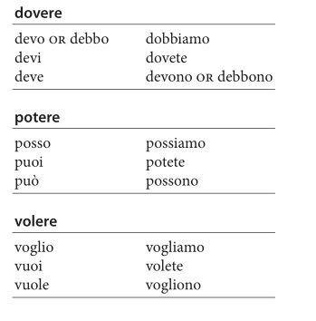
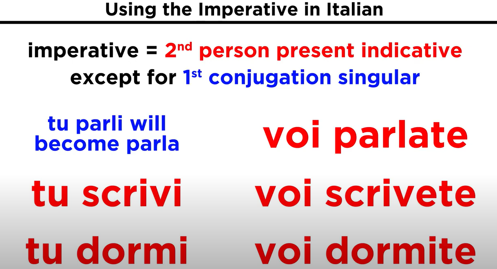
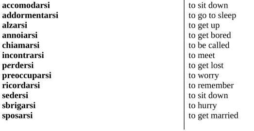

# Most Common 100 Verbs

## Common ARE Verbs

## Common ERE Verbs

## Common IRE Verbs 

# Modal Verbs!

## Tense Subtleties

It merits perusing each of the modals
[*volere*](https://www.thoughtco.com/conjugate-the-verb-volere-in-italian-4052436),
[*dovere*](https://www.thoughtco.com/how-to-conjugate-dovere-4056377),
and
[*potere*](https://www.thoughtco.com/how-to-conjugate-potere-4054228)
singularly to understand each verb better in its uses. But they share
many common traits.

In the *passato prossimo*, for example, *volere* means you wanted to do
something—carried out your will to do it—and, indeed, you did it (in
fact, the English "wanted" is a bit soft for the sense of the *passato
prossimo ho voluto*). Same with *dovere* and *potere*: you had to or
were able to do something and you did it.

-   *Ho voluto mangiare la pizza.* I wanted to eat a pizza (and I did).

    > *Ho dovuto visitare la nonna.* I had to/was obliged to visit
    > grandma (and I did).

    > *Ho potuto parlare con Giorgio.* I was able to talk with Giorgio
    > (and I did).

In the negative, if you say, *Non mi ha voluto vedere* (he/she didn't
want to see me), it means that he or she did not see you. If you say,
*Non ho dovuto dare l'esame* (I didn't have to take the exam), it means
you didn't have to (and, in Italian, we can assume you didn't, though in
the English it is not equally clear-cut).

With *potere*, if you say, *Non sono potuto andare*, it means you were
not able to go and you did not.

The *imperfetto*, on the other hand, is the tense used with modal verbs
for an action of imperfect arc (which wanting or being able to usually
are) whose outcome, without some clarification, is not certain. In fact,
sometimes one can imply that the outcome was not as expected.

-   *Volevano venire.* They wanted to come (and it's unclear if they
    > did).

    > *Potevano venire.* They could/were able to/could have come (and
    > it's implied that they didn't).

More information can be given to clarify the meaning, still with the
*imperfetto*, but sometimes a tense change is needed:

-   *Potevano venire ma non sono venuti.* They could come but they
    > didn't.

    > *Sarebbero potuti venire ma non sono venuti.* They could have come
    > but they didn't.

With *dovere*, the *imperfetto* can be expressed with the English "was
supposed to," depending on the outcome.

-   *Lo dovevo vedere ieri.* I was supposed to see him yesterday (and
    > it's assumed that I did not).

With *dovere* in the negative, if you say, *Non dovevo vederlo ieri,* it
means that you were not expected to see him yesterday, but you might
have. We would know more from the context. Again, in English, you would
differentiate with "supposed to."

If you say, *Non dovevo dare l'esame* (I didn't have to take the exam,
same translation in English as the *passato prossimo*), it means you
were not obliged to or supposed to or expected to take the exam (but you
might have taken it anyway).

## Transitive or Intransitive

Because modal verbs serve other verbs, in Italian, in their compound
tenses, they take on the auxiliary demanded by the verb they are
helping.

For example, if a modal verb is helping a transitive verb such as
*leggere* (to read), the modal verb takes
[*avere*](https://www.thoughtco.com/italian-verb-conjugations-avere-4093137)
in the compound lo tenses:

-   *A scuola ieri Lina non ha voluto leggere.* Yesterday at school Lina did not want to read (and did not).

    > *Ieri ho dovuto leggere un libro intero per il mio esame.*
    > Yesterday I had to read a whole book for my exam.

    > *Ieri non ho potuto leggere il giornale perché non ho avuto
    > tempo.* Yesterday I was not able to read the paper because I
    > didn't have time.

If the modal verb is helping an intransitive verb that takes *essere* or
a verb of movement that takes *essere*, for example, it takes
*[essere](https://www.thoughtco.com/italian-verb-conjugations-essere-4093070)*
(remember the agreement of the past participle with verbs with
*essere)*.

-   *Lucia non è voluta partire ieri.* Lucia did not want to leave yesterday (and she didn't).

- *Franco è dovuto partire ieri.* Franco had to leave yesterday.

- *Io non sono potuta partire perché ho perso il treno.* I was not able to leave because I missed my train.

And, with an intransitive verb that takes *avere*:

-  *Marco ha voluto cenare presto.* Marco wanted to have dinner early (and he did).

     - *Avremmo dovuto cenare prima.* We should have had dinner earlier.

    -*Non abbiamo potuto cenare prima.* We were not able to have dinner earlier.

Remember your ground rules for determining [the right
auxiliary](https://www.thoughtco.com/choosing-auxiliary-verbs-2011693)
for your main verb; sometimes it is a case-by-case choice, depending on
the use of the verb at that moment.

-   *Ho dovuto vestire i bambini.* I had to dress the children(transitive, *avere*).

    - *Mi sono dovuta vestire.* I had to get dressed (reflexive,*essere*).

Or, for example, with the verb *crescere* (to grow or grow up), which
can be intransitive or intransitive:

-   *Avresti voluto crescere i tuoi figli in campagna.* You would have liked to have raised your children in the country (transitive, *avere*).

    -*Saresti dovuta crescere in campagna.* You should have grown up in the country (intransitive, essere).

## The Odd Auxiliary

There are two exceptions or exemptions from the above rule about
auxiliary agreement of the modal verb:

### Followed by Essere

If a modal verb is followed by *essere*—*volere essere*, *potere
essere*, or *dovere essere*—in the compound tenses it wants *avere* as
its auxiliary (though *essere*'s auxiliary is *essere*).

-   *Avrei voluto essere più gentile.* I wished I had been kinder.

    > *Non ha potuto essere qui.* He was not able to be here.

    > *Credo che abbia dovuto essere molto paziente.* I think he had to
    > be/was forced to be very patient.

### Reflexive Pronoun Position

Also, when a modal verb accompanies a reflexive or reciprocal verb, you
use the auxiliary *essere* if the reflexive pronoun precedes the verbs,
but *avere* if the pronoun attaches to the infinitive that the modal is
supporting.

-   *Mi sono dovuta sedere*, or, *ho dovuto sedermi.* I had to sit.

    > *Mi sarei voluta riposare*, or, *avrei voluto riposarmi.* I would have liked to rest.

    > *Pensava che ci fossimo voluti incontrare qui,* or, *pensava che avessimo voluto incontrarci qui.* She thought that we had wanted to meet here.

If this confuses you, just make a rule of putting the pronoun ahead of
the verb and keeping your auxiliary *essere*.

## Pronouns

Which brings us to pronouns—direct object, indirect object, and
[combined double
object](https://www.thoughtco.com/double-object-pronouns-in-italian-4064640)—and
modal verbs. Modal verbs let pronouns be free to move about pretty
loosely: They can come before either verb or attach to the infinitive.

-   *Gli ho dovuto dare il libro*, or, *ho dovuto dargli il libro.* I
    > had to give him the book.

    > *Non gli ho potuto parlare*, or, *non ho potuto parlargli.* I was not able to speak with him,

    > *Glielo ho voluto dare,* or, *ho voluto darglielo.* I had to give it to him,

    > *Gli posso dare il gelato?* or, *posso dargli il gelato?* Can I give him the ice cream?

With double modal verbs, there is even more freedom, both with single
and double pronouns:

-   *Lo devo poter fare*, or, *devo poterlo fare*, or, *devo poter farlo.* I need to/must be able to do it.

    > *Non lo voglio dover incontrare*, or, *non voglio doverlo incontrare*, or, *non voglio dovere incontrarlo.* I don't want to have to meet him.

    > *Glielo potrei volere dare*, or, *potrei volerglielo dare*, or *potrei volere darglielo*. I might want to give it to her.

If you want to play with it a little, just start by putting the pronoun
at the top of the sentence and moving it down from verb to verb. If your
head is spinning... *vi potete sedere, or potete sedervi!*

# Present Tense 

# Imperfect Tense 

 

# Future 

**Compare to Avere!!!!!!!!!!!!!!!!!!!!!!!!!!!!!**

# Conditional 

# Present Subjunctive

# Imperative (Command)

in contonti

# Irregular -ARE Verbs -- Only 4 !

# 

# Reflexive Verbs 

# Piacere and Similar Verbs

## Personal form

This form is used to express the fact that someone is pleasing for
somebody else. The subject is the person that is pleasing: io, tu, lui,
lei, noi, voi, loro, etc. The verb agrees with the subject and it is
fully conjugated and the indirect object is the person that likes: a me,
a Mario, a qualcuno, a tutti etc.

-   Io piaccio a Carla -- Carla likes me

-   Tu piaci a tutti -- Everyone likes you

-   Lui piace a mia sorella -- My sister likes him

-   Lei piace a Massimo - Massimo likes you

-   Noi piacciamo alla gente - We like people

-   Voi piacete a mia nonna -- My grandmother likes you

-   Loro piacciono alla maestra -- The teacher likes them

# Passive Voice 

## Using the passive

-   Verbs can be active or passive.

-   In a sentence with an active verb the subject of the sentence does the action:

| **Subject** | **Active verb** | **Object**        |
|-------------|-----------------|-------------------|
| She         | does            | most of the work. |
| A dog       | bit             | him.              |

-   In a sentence with a passive verb the action is done by someone or something that is not the subject of the sentence.

| **Subject**      | **Passive verb** | **Who/what the action is done by** |
|------------------|------------------|------------------------------------|
| Most of the work | is done          | by her.                            |
| He               | was bitten       | by a dog.                          |

-   To show who or what is responsible for the action in a passive sentence you use *by* in English.

<!-- -->

-   You use passive rather than active verbs:

<!-- -->

-   when you want to focus on the person or thing affected by the action John was injured in an accident.

<!-- -->

-   when you don’t know who is responsible for the action My car was stolen last week.

## How to make the passive

-   In English we use the verb *to be* with a past participle (*is done, was bitten*) to make the passive.

<!-- -->

-   In Italian the passive is made in exactly the same way, using ***e*ssere** (meaning *to be*) and a past participle .

<!-- -->

-   *For more information on the* ***Past participle**, see [The perfect
 tense](https://grammar.collinsdictionary.com/us/italian-easy-learning/the-perfect-tense).*

| **Siamo invitati ad una festa a casa loro.**   | We’re invited to a party at their house.        |
|------------------------------------------------|-------------------------------------------------|
| **L’elettricit*à*** **è stata tagliata ieri.** | The electricity was cut off yesterday.          |
| **La partita** **è stata rinviata.**           | The match has been postponed.                   |
| **È stato costretto a ritirarsi dalla gara.**  | He was forced to withdraw from the competition. |

-   When you say who or what is responsible for the action you use
    > **da** (meaning *by*).

| **I ladri** **sono stati catturati dalla polizia.** | The thieves were caught by the police. |
|-----------------------------------------------------|----------------------------------------|

-   Note that the past participle agrees with the subject of the verb
    > ***e*ssere** in the same way an adjective would.

# Impersonal Si Verbs and Passive 

Look at the following sentences:

1.  They sell stamps in the grocery store.

2.  You need to exercise in order to stay healthy.

3.  People work too hard around here.

4.  One should respect the feelings of others.

All of these sentences have a subject that is impersonal. They or you in
the first two examples do not refer to particular individuals, but
rather to a general public, just as people and one do in examples three
and four.

In Italian, the si impersonale – a combination of si and the verb – is
used to convey the same idea. No extra subject (like tu, loro, la gente,
uno, etc.) is required.

## Forms

To form the si impersonale, use the si pronoun in front of the lui/lei
or loro form of the verb. Have a look at the Italian versions of the
examples above:

1.  Si vendono i francobolli al supermercato.

2.  Si deve praticare l’esercizio fisico per stare sani.

3.  Si lavora troppo da questa parte.

4.  Si devono rispettare i sentimenti degli altri.

## Lui/Lei vs. Loro Forms

How do you decide whether to use the lui/lei or the loro form of the
verb? Use the following guidelines:

-   If there is no direct object in the sentence (as in \#3), use the lui/lei form. Other examples include:

    -   Di sera si va al cinema. In the evening people go to the movies.

    -   A che ora si esce la mattina? What time to you all leave in the morning?

    -   Con chi si deve parlare? Who do we have to talk with?

-   If there is a direct object in the sentence, use the lui/lei form of the verb if the object is singular and the loro form of the verb if the object is plural. \#1 has a plural object (francobolli), hence a plural verb (vendono). \#2 has a singular noun (l’esercizio), hence a singular verb (deve). Other examples include:

    -   A casa mia si mangia molto gelato. At my house, you eat a lot of ice cream.

    -   Ai ristoranti più popolari non si accettano le prenotazioni. At the most popular restaurants, they don’t accept reservations.

    -   Non si sa mai la verità. One never knows the truth.

## Si Impersonale with Two Verbs

If two verbs are used (as in \#2 & \#4), only the first one is
conjugated, while the second one remains an infinitive. Remember, you
still look to the direct object (if there is one), to decide between the
lui/lei or loro form of the first verb. In \#4, the verb takes the loro
form (devono) because of the plural noun (sentimenti).

✽ A direct object is the entity that is acted upon by the verb. It can
be a person (the friend I invited), an object (the book I read), a place
(the city we visited) or an abstract concept (the time I wasted). It is
not the agent carrying out the action (in the examples above, I and we)
but rather the recipient or the product of that action, and there is no
preposition (a, in, con, da, di, etc.) mediating the relationship
between the verb and the object.

## Si impersonale with Reflexive Verbs

If you use a reflexive verb in the si impersonale, the first si becomes
a ci. For example:

-   Ci si diverte alla spiaggia. You have fun at the beach.

-   All’università durante l’estate ci si alza molto tardi. At the university during the summer you get up pretty late.

## Si impersonale with Adjectives

If you use an adjective with the si impersonale, for some strange
reason, the adjective always uses its masculine plural ending, even
though the verb used with the si is singular. For example:

-   Si è sempre contenti quando si ricevono complimenti dagli altri.

-   You are always happy when you get compliments from others.Dopo la lunga passeggiata si è molto stanchi. After the long walk, people are really tired.

## Si impersonale Through the Tenses

You can use the si impersonale in any tense. Follow the same rules above
for the future, imperfect, and all other simple tenses. The compound
tenses (like the passato prossimo, future perfect, and past conditional)
are a bit tricky. With these, always use essere in combination with the
si impersonale and passivante. If your sentence has a direct object, the
verb form (lui/lei or loro) will still depend on the object. If your
sentence has a direct object, the

ending of the past participle will agree with that object. For example:

-   Si è mangiata la pizza?

-   Si sono lavate le mani?

-   Si è pulito il bagno?

-   Si sono comprati i biglietti?

If there is no direct object, the past participle ends in -o if that
verb generally goes with avere, and -i if it generally goes with essere.
For example:

-   Si è telefonato al ristorante per fare una prenotazione?

-   A che ora si è partiti?

-   Perché si è andati via?

✽ If the si impersonale construction has multiple verbs or if it is
extended over two phrases in a sentence (connected by a conjunction like
e, o, perché, quando, se, etc.), don’t forget to use a si with every new
verb: e.g.

Quando si è al mare, si nuota, si prende il sole e ci si diverte con gli
amici.

✽ Because you are already expressing the impersonal you through si, any
other references to this impersonal subject (tu, loro, uno) would be
extraneous.

## Passive (Il passivo)

What does it mean for a verb to be passive? Take these two examples:

-   The president held a press conference yesterday.

-   A press conference was held by the president yesterday.

In the first example, the verb is active, meaning the subject of the
sentence (the president) carries out or executes the action (held). In
the second example, rather, the verb is passive, because the subject of
the sentence (a press conference) is acted upon. Recall that in writing
classes, passive constructions are often discouraged when the agent of
the action (like the president) is mentioned. Passive constructions tend
to water down the significance of the action, and strong writing often
relies on use of the active voice to make its points lucidly and
persuasively. However, the passive voice is often useful when the agent
of the action is unknown or impersonal. For example:

-   When were those dormitories built?

-   My car was stolen.

-   Are many Italian dictionaries sold here?

In Italian, a passive voice certainly exists. It is much like English.
It is formed by putting essere in the appropriate tense and adding the
past participle of the main verb.

<table>
<colgroup>
<col style="width: 34%" />
<col style="width: 35%" />
<col style="width: 29%" />
</colgroup>
<thead>
<tr class="header">
<th><blockquote>

<strong>English</strong>

</blockquote></th>
<th><blockquote>

<strong>Italian</strong>

</blockquote></th>
<th><blockquote>

<strong>Passive Verb Tense</strong>

</blockquote></th>
</tr>
<tr class="odd">
<th><blockquote>

When were those dormitories built?

</blockquote></th>
<th><blockquote>

Quando <strong>furono costruiti</strong> quei dormitori?

</blockquote></th>
<th><blockquote>

passato remoto

</blockquote></th>
</tr>
<tr class="header">
<th><blockquote>

My car was stolen

</blockquote></th>
<th><blockquote>

La mia macchina <strong>è stata rubata</strong>.

</blockquote></th>
<th><blockquote>

passato prossimo

</blockquote></th>
</tr>
<tr class="odd">
<th><blockquote>

Many Italian dictionaries are sold here.

</blockquote></th>
<th><blockquote>

Qui <strong>sono venduti</strong> molti vocabolari italiani.

</blockquote></th>
<th><blockquote>

presente

</blockquote></th>
</tr>
<tr class="header">
<th><blockquote>

A new prime minister will be elected next year.

</blockquote></th>
<th><blockquote>

Un nuovo primo ministro <strong>sarà eletto</strong> l’anno
prossimo.

</blockquote></th>
<th><blockquote>

futuro

</blockquote></th>
</tr>
<tr class="odd">
<th><blockquote>

During our time at the hotel the room was cleaned every day

</blockquote></th>
<th><blockquote>

Durante il tempo all’albergo la camera <strong>era pulita</strong>
ogni giorno.

</blockquote></th>
<th><blockquote>

imperfetto

</blockquote></th>
</tr>
</thead>
<tbody>
</tbody>
</table>

✽ Do not get overwhelmed by the details of putting verbs of different
tenses in the passive. It is easier than you think. Think of the passive
as a mere combination of the verb essere (in the proper tense) together
with the past participle of the main verb. For example:

<table>
<colgroup>
<col style="width: 47%" />
<col style="width: 52%" />
</colgroup>
<thead>
<tr class="header">
<th><blockquote>

La lettera è scritta.

</blockquote></th>
<th><blockquote>

<em>The letter is written.</em>

</blockquote></th>
</tr>
<tr class="odd">
<th><blockquote>

La lettera è stata scritta.

</blockquote></th>
<th><blockquote>

<em>The letter was written.</em>

</blockquote></th>
</tr>
<tr class="header">
<th><blockquote>

La lettera sarà scritta.

</blockquote></th>
<th><blockquote>

<em>The letter will be written.</em>

</blockquote></th>
</tr>
<tr class="odd">
<th><blockquote>

La lettera sarebbe scritta.

</blockquote></th>
<th><blockquote>

<em>The letter would be written.</em>

</blockquote></th>
</tr>
</thead>
<tbody>
</tbody>
</table>

In all these sentences, you use the lui/lei form of essere (which agrees
with the singular subject, la lettera), putting it in the proper tense
(present, passato prossimo, future, conditional) and combining it with
the past participle of scrivere, scritta (which ends in -a in order to
agree with the subject, la lettera).

## Passivo o si impersonale?

In Italian, the passive is used much less than it is in English. In
place of the passive, you often use the si impersonale:

<table>
<colgroup>
<col style="width: 33%" />
<col style="width: 33%" />
<col style="width: 33%" />
</colgroup>
<thead>
<tr class="header">
<th><blockquote>

<strong>English</strong>

</blockquote></th>
<th><blockquote>

<strong>Passive</strong>

</blockquote></th>
<th><blockquote>

<strong>Si impersonale</strong>

</blockquote></th>
</tr>
<tr class="odd">
<th><blockquote>

When were those dormitories built?

</blockquote></th>
<th><blockquote>

Quando furono costruiti quei dormitori?

</blockquote></th>
<th><blockquote>

Quando <strong>si costruirono</strong> quei dormitori?

</blockquote></th>
</tr>
<tr class="header">
<th><blockquote>

My car was stolen

</blockquote></th>
<th><blockquote>

La mia macchina è stata rubata.

</blockquote></th>
<th><blockquote>

<strong>Si è rubata</strong> la mia macchina.

</blockquote></th>
</tr>
<tr class="odd">
<th><blockquote>

Many Italian dictionaries are sold here.

</blockquote></th>
<th><blockquote>

Qui sono venduti molti vocabolari italiani.

</blockquote></th>
<th><blockquote>

Qui <strong>si vendono</strong> molti vocaboli italiani.

</blockquote></th>
</tr>
<tr class="header">
<th><blockquote>

A new prime minister will be elected next year.

</blockquote></th>
<th><blockquote>

Un nuovo primo ministro sarà eletto l’anno prossimo.

</blockquote></th>
<th><blockquote>

<strong>Si eleggerà</strong> un nuovo primo ministro l’anno
prossimo.

</blockquote></th>
</tr>
<tr class="odd">
<th><blockquote>

During our time at the hotel the room was cleaned every day.

</blockquote></th>
<th><blockquote>

Durante il tempo all’albergo la camera era pulita ogni giorno.

</blockquote></th>
<th><blockquote>

Durante il tempo all’albergo <strong>si puliva</strong> la camera
ogni giorno.

</blockquote></th>
</tr>
</thead>
<tbody>
</tbody>
</table>

# Verb Charts 

# Past Participle

# 

## Verbs that Take Essere as Auxiliary Verb 

## Reflexive Verbs also Use Essere 

<u>Intransitive Examples</u>

-   **Il film è finito alle 5:00.** The film was over at 5:00.

-   **Le vacanze sono cominciate ieri.** The holidays started yesterday.

-   **La mia vita è cambiata.** My life has changed.

-   **Sono passato in ufficio.** I stopped by at the office.

-   **Siamo saliti sul treno.** We boarded the train.

-   **Siamo scesi in cantina.** We went down in the cellar.

<u>Transitive Example</u>

-   **Ho finito il libro.** I finished the book.

-   **Ha cominciato la lezione alle 8:00.** He began class at 8:00.

-   **Hai cambiato lavoro.** You changed jobs.

-   **Ho passato le vacanze in Italia.** I spent the holidays in Italy.

-   **Ho salito le scale di corsa.** I climbed the stairs in a rush.

-   **Abbiamo sceso le scale.** We went down the stairs.

# 

# 

## Irregular Past Participles 

<table>
<colgroup>
<col style="width: 42%" />
<col style="width: 17%" />
<col style="width: 16%" />
<col style="width: 23%" />
</colgroup>
<thead>
<tr class="header">
<th><strong>INFINITIVE</strong></th>
<th><strong>PAST PARTICIPLE</strong></th>
<th><strong>VERBS IN SAME FAMILY</strong></th>
<th><strong>RESPECTIVE PAST PARTICIPLES</strong></th>
</tr>
<tr class="odd">
<th>Verbs in -ere like PROPORRE</th>
<th><em>proposto</em></th>
<th><em>opporre</em></th>
<th><em>opposto</em></th>
</tr>
<tr class="header">
<th>Verbs in -<em>ere</em> like <em>RIDERE</em></th>
<th><em>riso</em></th>
<th>
<em>coincidere</em>

<em>condividere</em>

<em>dividere</em>

<em>esplodere</em>

<em>evadere</em>

<em>implodere</em>

<em>perdere</em>
</th>
<th>
<em>coinciso</em>

<em>condiviso</em>

<em>diviso</em>

<em>esploso</em>

<em>evaso</em>

<em>imploso</em>

<em>perso</em>
</th>
</tr>
<tr class="odd">
<th>Verbs in -<em>endere</em> like <em>ACCENDERE</em> and
<em>PRENDERE</em></th>
<th>
<em>acceso</em>

<em>preso</em>
</th>
<th>
<em>arrendere</em>

<em>ascendere</em>

<em>dipendere</em>

<em>discendere</em>

<em>offendere</em>

<em>pretendere</em>

<em>riaccendere</em>

<em>scendere</em>

<em>spendere</em>

<em>tendere</em>
</th>
<th>
<em>arreso</em>

<em>asceso</em>

<em>dipeso</em>

<em>disceso</em>

<em>offeso</em>

<em>preteso</em>

<em>riacceso</em>

<em>sceso</em>

<em>speso</em>

<em>teso</em>
</th>
</tr>
<tr class="header">
<th>Verbs like <em>CHIEDERE</em></th>
<th><em>chiesto</em></th>
<th><em>richiedere</em></th>
<th><em>richiesto</em></th>
</tr>
<tr class="odd">
<th>Verbs in -<em>dere</em> like <em>CHIUDERE</em></th>
<th><em>chiuso</em></th>
<th>
<em>persuadere</em>

<em>racchiudere</em>

<em>rinchiudere</em>
</th>
<th>
<em>persuaso</em>

<em>racchiuso</em>

<em>rinchiuso</em>
</th>
</tr>
<tr class="header">
<th>Verbs in -<em>scere</em> like <em>CONOSCERE</em></th>
<th><em>conosciuto</em></th>
<th>
<em>crescere</em>

<em>riconoscere</em>

<em>rincrescere</em>
</th>
<th>
<em>cresciuto</em>

<em>riconosciuto</em>

<em>rincresciuto</em>
</th>
</tr>
<tr class="odd">
<th>Verbs like <em>CEDERE</em></th>
<th><em>cesso</em></th>
<th>
<em>concedere</em>

<em>succedere</em>
</th>
<th>
<em>concesso</em>

<em>successo</em>
</th>
</tr>
<tr class="header">
<th>Verbs in -<em>ettere</em> like <em>METTERE</em></th>
<th><em>messo</em></th>
<th>
<em>intromettere</em>

<em>permettere</em>

<em>premettere</em>

<em>promettere</em>
</th>
<th>
<em>intromesso</em>

<em>permesso</em>

<em>premesso</em>

<em>promesso</em>
</th>
</tr>
<tr class="odd">
<th>Verbs in -<em>gliere</em> like <em>COGLIERE</em></th>
<th><em>colto</em></th>
<th>
<em>accogliere</em>

<em>raccogliere</em>

<em>sciogliere</em>
</th>
<th>
<em>accolto</em>

<em>raccolto</em>

<em>sciolto</em>
</th>
</tr>
<tr class="header">
<th>Verbs like <em>DIRE</em></th>
<th><em>detto</em></th>
<th>
<em>benedire</em>

<em>disdire</em>

<em>interdire</em>

<em>maledire</em>

<em>predire</em>
</th>
<th>
<em>benedetto</em>

<em>disdetto</em>

<em>interdetto</em>

<em>maledetto</em>

<em>predetto</em>
</th>
</tr>
<tr class="odd">
<th>Verbs in -<em>durre</em> like <em>PRODURRE</em></th>
<th><em>prodotto</em></th>
<th><em>ridurre</em></th>
<th><em>ridotto</em></th>
</tr>
<tr class="header">
<th>Verbs like <em>FARE</em></th>
<th><em>fatto</em></th>
<th>
<em>confare</em>

<em>disfare</em>

<em>rarefare</em>

<em>rifare</em>

<em>soddisfare</em>

<em>sopraffare</em>

<em>strafare</em>
</th>
<th>
<em>confatto</em>

<em>disfatto</em>

<em>rarefatto</em>

<em>rifatto</em>

<em>soddisfatto</em>

<em>sopraffatto</em>

<em>strafatto</em>
</th>
</tr>
<tr class="odd">
<th>Verbs in -<em>gere</em> like <em>PIANGERE</em></th>
<th><em>pianto</em></th>
<th>
<em>giungere</em>

<em>raggiungere</em>

<em>spengere</em>

<em>volgere</em>
</th>
<th>
<em>giunto</em>

<em>raggiunto</em>

<em>spento</em>

<em>volto</em>
</th>
</tr>
<tr class="header">
<th>Verbs in -<em>ggere</em> like <em>LEGGERE</em></th>
<th><em>letto</em></th>
<th>
<em>distruggere</em>

<em>eleggere</em>

<em>friggere</em>

<em>reggere</em>

<em>rileggere</em>

<em>sconfiggere</em>

<em>trafiggere</em>
</th>
<th>
<em>distrutto</em>

<em>eletto</em>

<em>fritto</em>

<em>retto</em>

<em>riletto</em>

<em>sconfitto</em>

<em>trafitto</em>
</th>
</tr>
<tr class="odd">
<th>Verbs in -<em>ondere</em> like <em>RISPONDERE</em></th>
<th><em>risposto</em></th>
<th>
<em>corrispondere</em>

<em>nascondere</em>
</th>
<th>
<em>corrisposto</em>

<em>nascosto</em>
</th>
</tr>
<tr class="header">
<th>Verbs like <em>ROMPERE</em></th>
<th><em>rotto</em></th>
<th>
<em>corrompere</em>

<em>dirompere</em>
</th>
<th>
<em>corrotto</em>

<em>dirotto</em>
</th>
</tr>
<tr class="odd">
<th>Verbs like <em>SCRIVERE</em></th>
<th><em>scritto</em></th>
<th><em>riscrivere</em></th>
<th><em>riscritto</em></th>
</tr>
<tr class="header">
<th>Verbs like <em>TRARRE</em></th>
<th><em>tratto</em></th>
<th>
<em>contrarre</em>

<em>ritrarre</em>

<em>sottrarre</em>
</th>
<th>
<em>contratto</em>

<em>ritratto</em>

<em>sottratto</em>
</th>
</tr>
<tr class="odd">
<th>Verbs like <em>VEDERE</em></th>
<th><em>visto (or veduto)</em></th>
<th>
<em>avvedere</em>

<em>intravvedere</em>

<em>prevedere</em>

<em>provvedere</em>

<em>rivedere</em>
</th>
<th>
<em>avvisto</em>

<em>intravisto</em>

<em>previsto</em>

<em>provvisto/provveduto</em>

<em>rivisto</em>
</th>
</tr>
<tr class="header">
<th>Verbs like <em>VENIRE</em></th>
<th><em>venuto</em></th>
<th>
<em>avvenire</em>

<em>convenire</em>

<em>sovvenire</em>

<em>svenire</em>
</th>
<th>
<em>avvenuto</em>

<em>convenuto</em>

<em>sovvenuto</em>

<em>svenuto</em>
</th>
</tr>
<tr class="odd">
<th>Verbs like <em>VINCERE</em></th>
<th><em>vinto</em></th>
<th>
<em>convincere</em>

<em>stravincere</em>
</th>
<th><em>convinto</em></th>
</tr>
<tr class="header">
<th>Verbs like <em>VIVERE</em></th>
<th><em>vissuto</em></th>
<th>
<em>convivere</em>

<em>sopravvivere</em>
</th>
<th>
<em>convissuto</em>

<em>sopravvissuto</em>
</th>
</tr>
<tr class="odd">
<th>Verbs in-<em>parire</em> like <em>APPARIRE</em></th>
<th><em>apparso</em></th>
<th>
<em>riapparire</em>

<em>scomparire</em>
</th>
<th>
<em>riapparso</em>

<em>scomparso</em>
</th>
</tr>
<tr class="header">
<th>Verbs like <em>APRIRE</em></th>
<th><em>aperto</em></th>
<th>
<em>coprire</em>

<em>offrire</em>
</th>
<th>
<em>coperto</em>

<em>offerto</em>
</th>
</tr>
</thead>
<tbody>
</tbody>
</table>

# Irregular Gerunds 

# 

# Verb Charts 

 

