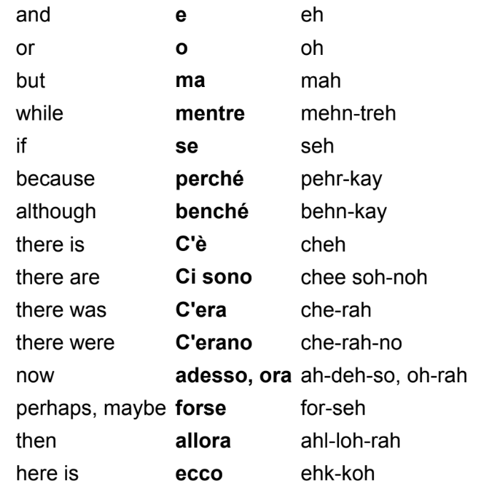
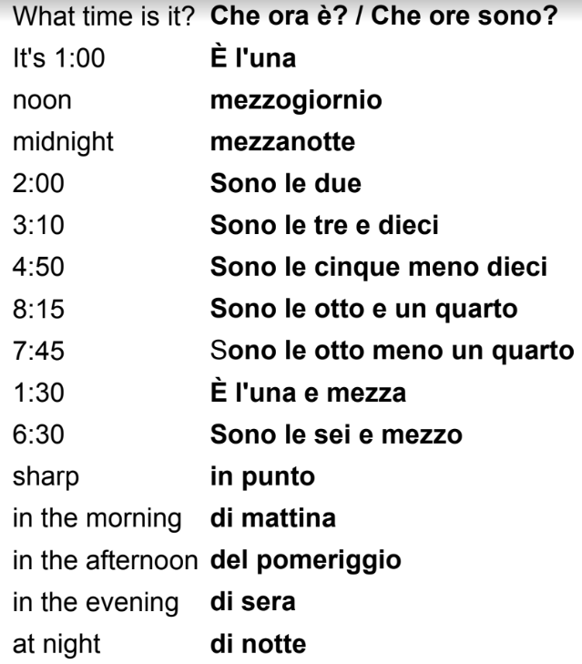
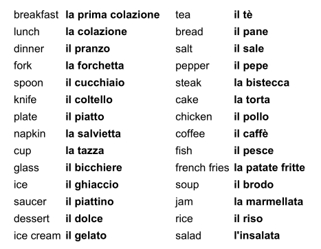
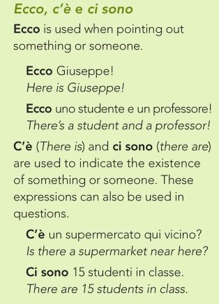
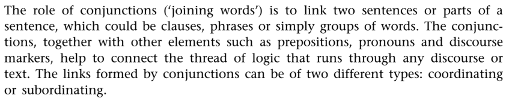
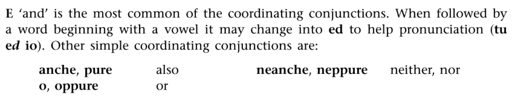
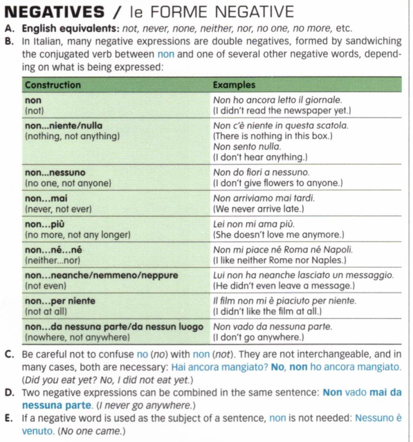
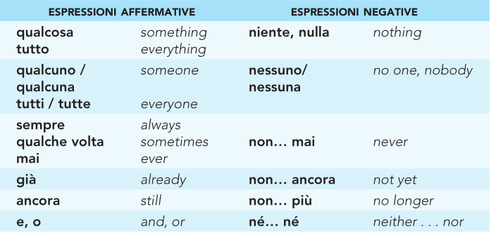

# **Vocabulary and Other Important Words**

## Don't Forget

-   PROVARE A + INF.

-   CERCARE DI + INF. = TRY AND DO SOMETHING

-   PROVARE STH = to try on or to taste

-   CERCARE STH = to look for / to search for

-   TROVARE = to find

## Even

-   You didn't even pay

    -   Non hai <u>nemmeno</u> pagato

-   Not even Isiah was a four-year starter.

    -   <u>Nemmeno</u> Isiah è stato un titolare per quattro anni di seguito.

## Non-Verb-Piu

-   You guys do not paint anymore

    -   Voi non dipingete più

-   I don't go anymore

    -   Non ci vado più

## Any -- Qualunque / Qualsiasi

-   **Any** option is good for me

    -   **Qualunque / qualsiasi** opzione buona per me

## Fare La Spesa 

-   I've got to go shopping.

    -   Sono uscita di fretta a <u>fare la spesa</u>.

-   Contestants would compete for the opportunity to go shopping.

    -   I concorrenti gareggiano per la possibilità <u>di fare la spesa</u>.

-   I've been meaning to go shopping.

    -   Avevo intenzione <u>di fare la spesa</u>.

-   Did you remember to go shopping?

    -   Ti sei ricordato <u>di fare la spesa</u>?

## Weekend

-   Questo fine settimana ..,

-   Il prossimo fine settimana, partiro per la francia

-   Rosie spent the weekend at my house.

    -   Certo, Rosie ha passato **il fine settimana** a casa mia.

-   Charlie asked me to stay the weekend.

    -   Charlie mi ha chiesto di passare con lui il fine settimana.

-   Ashley had the weekend to remove her belongings.

    -   Ashley aveva il fine settimana per rimuovere i suoi

-   Informatively, there are some courses that are extremely crowded in the weekends.

    -   Informatively, ci sono alcuni corsi che sono estremamente affollato nei fine settimana.

-   This method works because rental companies offer lower costs for <u>the weekends</u>.

    -   Questo metodo funziona perché le agenzie di noleggio spesso abbassano i costi **nei fine settimana.**

# Vocabulary 

# Critical Words

-   chiunque pron. \[chiùn-que\] – whoever; anyone, anybody.

-   comunque -- anyway, though

-   ovunque -- everywhere, wherever

-   dovunque -- anywhere

-   dunque -- so, therefor

<!-- -->

-   soprattutto - mostly (overall)

-   dappertutto - everywhere

-   purtroppo -- unfortunately

-   dopotutto - after all

# Conjunctions

# Negatives

-   Non sono <u>mai</u> stato in Italia **Not am ever been in Italy**

-   Non sono <u>mai</u> stato in America. **I’ve never been to America.**

-   Non vedo <u>niente</u> **Not I see nothing**

-   Non lo vedo **Not I see him**

-   Non e venuto <u>nessuno</u> **Not is come nobody (Nobody came)**

-   Non abita <u>piu</u> qui **Not he live more here (He no longer lives here)**

-   Non e venuto <u>neanche</u> il presidente **Not is come not even president (Not even the president came)**

-   Non abbiamo visitato <u>ne</u> Roma <u>ne</u> Firenze   **We visited neither Rome nor Florence**

-   Sto bene. Non ho <u>né</u> fame <u>né</u> sete. **I’m fine. I’m neither hungry nor thirsty.**

-   Chi e venuto con Lei? **Nessuno. Who came with you? No one.**

-   Non c’è <u>più</u> benzina. **There isn’t any more petrol.**

-   Non ho <u>niente</u> da dire. **I have nothing to say.**

-   Non ti amo. **I don’t love you.**

-   Non lavora mai. **He/She never works.**

-   Non sa niente. **He/She knows nothing.**

-   Non vedete nessuno. **You don’t see anybody.**

-   Non mi ami più. **You don’t love me anymore.**

-   Non lo facciamo mai più. **We won’t do it again (“never anymore”).**

